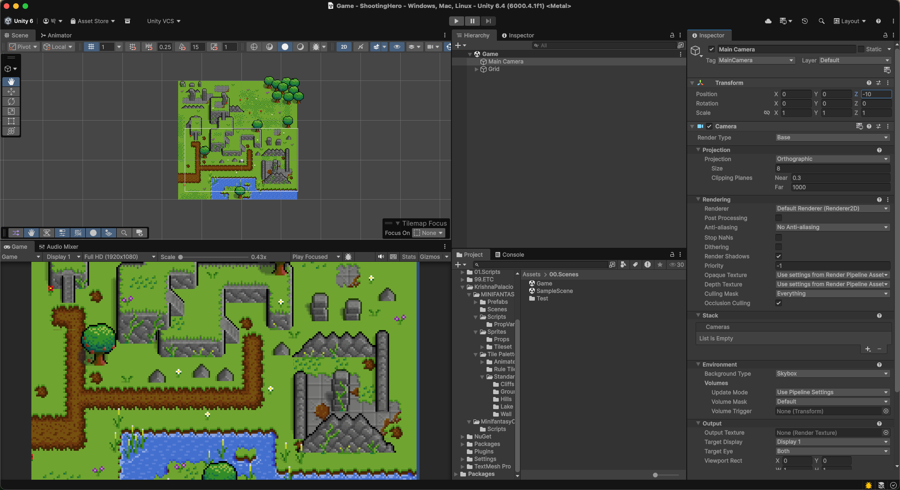
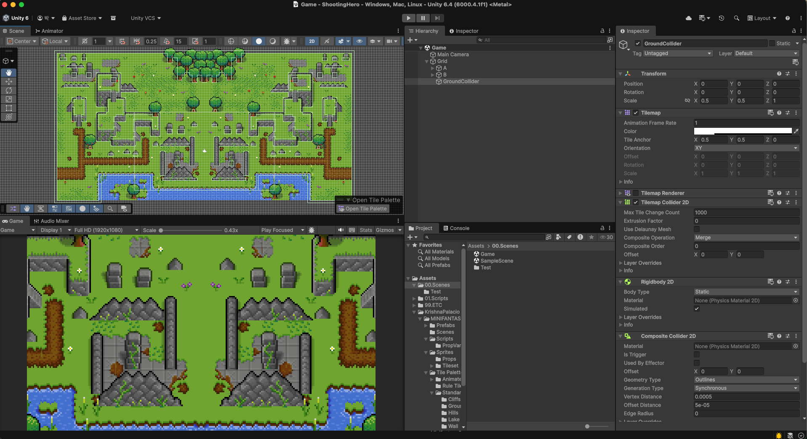
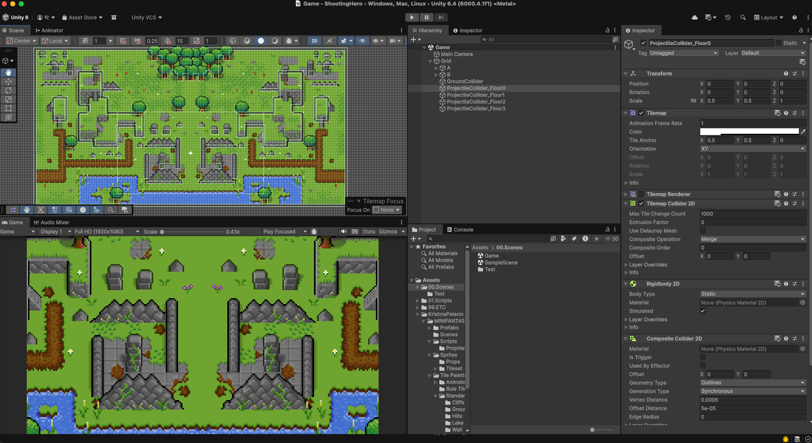
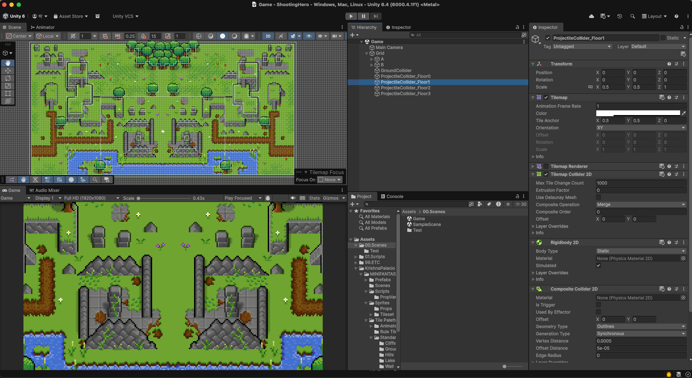
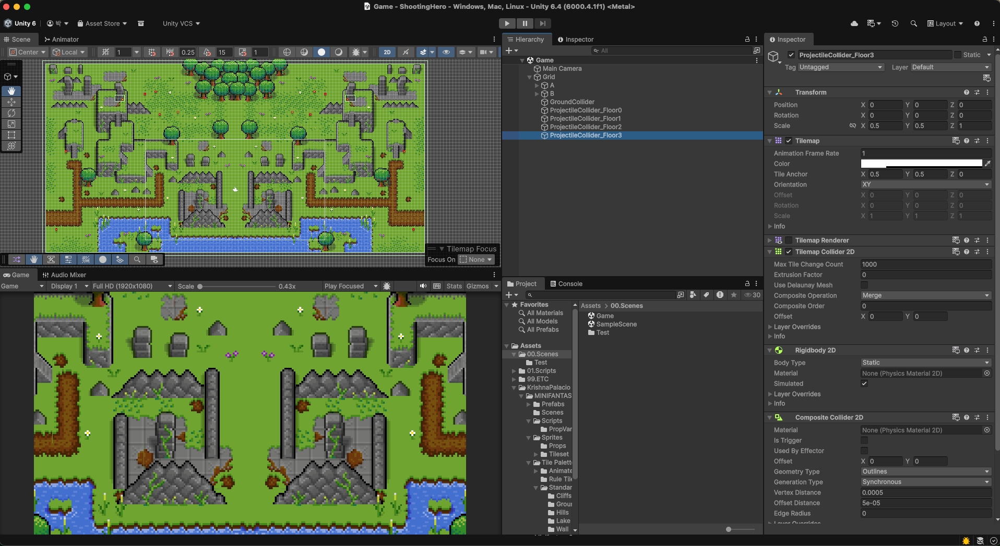
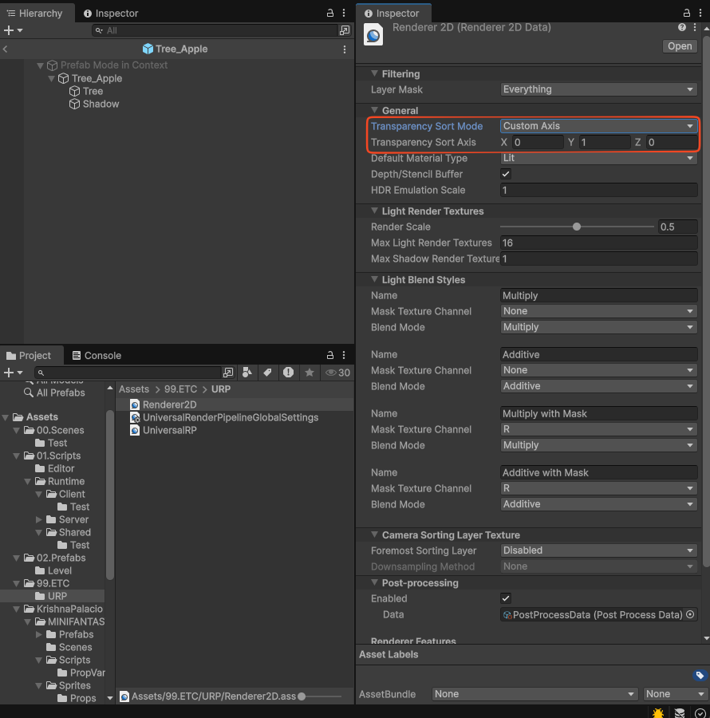
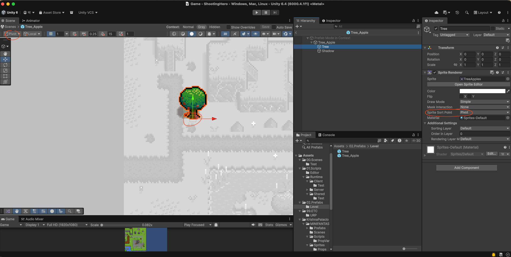

# ShootingHero
Unity Dedicated Server Learning Project

### 유니티 프로젝트 폴더 구조
```
00.Scenes
01.Scripts
  ㄴ Editor
      ㄴ ShootingHero.Editor.asmdef
  ㄴ Runtime
    ㄴ Client
      ㄴ ShootingHero.Clients.asmdef
    ㄴ Server
      ㄴ ShootingHero.Servers.asmdef
    ㄴ Shared
      ㄴ ShootingHero.Shared.asmdef
99.ETC
  ㄴ URP
```

```
ShootingHero.Clients.asmdef 에 ShootingHero.Shared.asmdef 참조 추가
ShootingHero.Servers.asmdef 에 ShootingHero.Shared.asmdef 참조 추가

! 필요시 !
ShootingHero.Editor.asmdef 에 ShootingHero.Clients.asmdef 참조 추가
ShootingHero.Editor.asmdef 에 ShootingHero.Servers.asmdef 참조 추가
ShootingHero.Editor.asmdef 에 ShootingHero.Shared.asmdef 참조 추가
```

### 라이브러리 임포트
1. NugetForUnity 추가 (`./Assets/NuGetForUnity.4.5.0.unitypackage`)
2. NugetForUnity - System.Threading.Channels 추가
3. NugerForUnity - MemoryPack 추가
4. Assets/Plugins 하위에 ShootingHeroNetworks.dll 추가 (`./Assets/ShootingHeroNetworks.dll`)

### 에셋 임포트
https://assetstore.unity.com/packages/2d/environments/minifantasy-forgotten-plains-208907

Assets/KrishnaPalacio/MINIFANTASY - Forgotten Plains/Scenes/Demo - Forgotten Plains.unity 의 Level을 복사하여 Game Scene 생성



### 타일맵 설정
레벨 타일맵 배치 후 0.5 스케일의 이동 콜라이더용 타일맵 배치. (콜라이더용 타일맵 렌더러 비활성화)



0.5 스케일의 높이 별 총알용 콜라이더 배치.






### 스프라이트 피벗 및 URP 2D TransparencySortMode
오브젝트의 y좌표를 기준으로 렌더링 오더를 정렬하기 위해 URP2D 렌더러의 TransparencySortMode 를 Custom Axis로 설정 후 (0, 1, 0) 으로 설정



존재하는 프롭 SpriteRenderer의 SpriteSortPoint를 Pivot으로 설정 및 Sprite의 Pivot을 BottomCenter로 설정하여 피벗이 오브젝트의 중앙 하단으로 설정.



`./Assets/LevelAssets.unitypackage` 참고