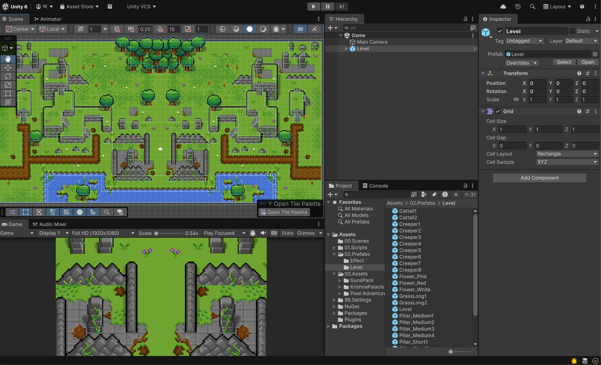
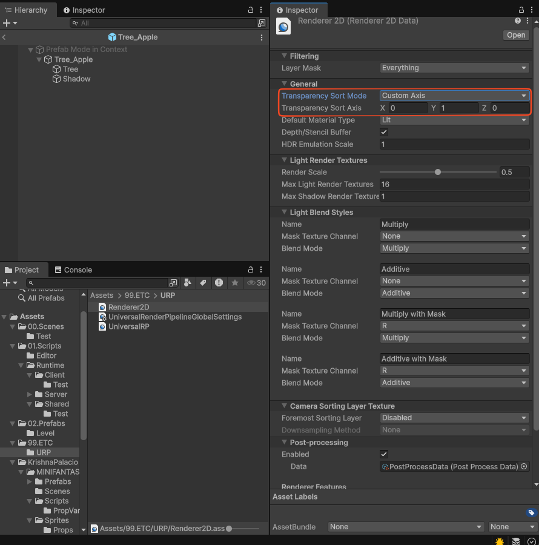
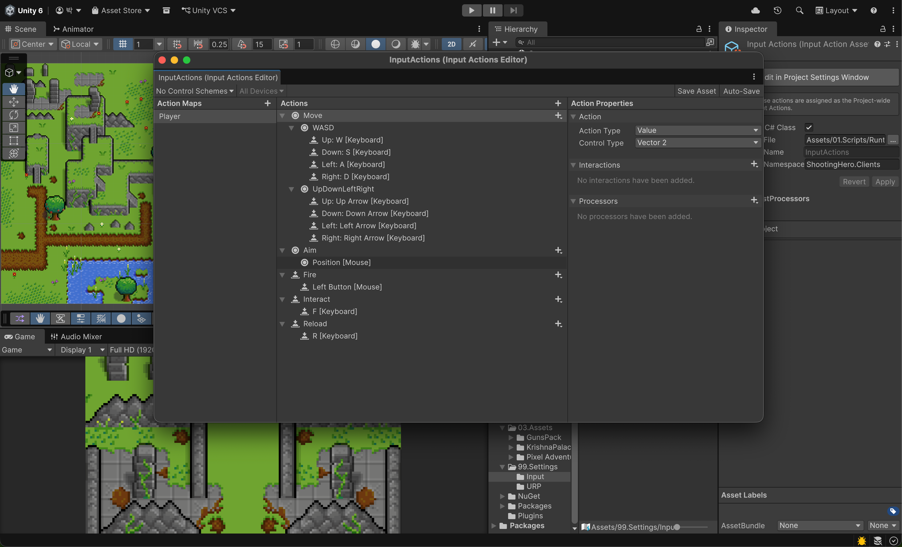

# ShootingHero
Unity Dedicated Server Learning Project

### 프로젝트 생성
Unity 6.4.1f1 Universal 2D 프로젝트 생성

### 유니티 프로젝트 폴더 구조
```
00.Scenes
01.Scripts
  ㄴ Runtime
    ㄴ Client
      ㄴ ShootingHero.Clients.asmdef
    ㄴ Server
      ㄴ ShootingHero.Servers.asmdef
    ㄴ Shared
      ㄴ ShootingHero.Shared.asmdef
99.ETC
  ㄴ URP
```

```
ShootingHero.Clients.asmdef 에 ShootingHero.Shared.asmdef 참조 추가
ShootingHero.Servers.asmdef 에 ShootingHero.Shared.asmdef 참조 추가
```

### 라이브러리 임포트
1. NugetForUnity 추가 (`./Assets/NuGetForUnity.4.5.0.unitypackage`)
2. NugetForUnity - System.Threading.Channels 추가
3. NugerForUnity - MemoryPack 추가
4. UMP - https://github.com/Cysharp/MemoryPack.git?path=src/MemoryPack.Unity/Assets/MemoryPack.Unity 추가
5. UMP - https://github.com/Cysharp/UniTask.git?path=src/UniTask/Assets/Plugins/UniTask 추가
6. Assets/Plugins 하위에 ShootingHeroNetworks.dll 추가 (`./Assets/ShootingHeroNetworks.dll`)

### 에셋 임포트
./Assets/ShootingHeroAssets.unitypackage 임포트

Game.unity 씬 생성하여 02.Prefabs/Level/Level.prefab 배치



### 스프라이트 피벗 및 URP 2D TransparencySortMode
오브젝트의 y좌표를 기준으로 렌더링 오더를 정렬하기 위해 URP2D 렌더러의 TransparencySortMode 를 Custom Axis로 설정 후 (0, 1, 0) 으로 설정



### 공용 코어 스크립트 작성

```cs
// 01.Scripts/Runtime/Shared/Core/GameManager.cs

using UnityEngine;

namespace ShootingHero.Shared
{
    public class GameManager : MonoBehaviour
    {
        private static GameManager instance = null;
        public static GameManager Instance => instance;

        public void Initialize()
        {
            if(instance != null)
            {
                instance.Release();
                Destroy(instance.gameObject);
            }

            instance = this;
            DontDestroyOnLoad(gameObject);
        }

        public void Release()
        {
            
        }
    }
}
```

```cs
// 01.Scripts/Runtime/Shared/Core/UnityPacketDispatcher.cs
// ShootingHero.Shared.asmdef 에 UniTask.asmdef 참조 추가

using System;
using System.Collections.Concurrent;
using System.Threading.Tasks;
using Cysharp.Threading.Tasks;
using ShootingHero.Networks;
using UnityEngine;

namespace ShootingHero.Shared
{
    public class UnityPacketDispatcher : MonoBehaviour, IPacketDispatcher
    {
        private readonly ConcurrentQueue<(Session, IPacket)> packetQueue = new ConcurrentQueue<(Session, IPacket)>();
        
        private bool isProcessing = false;
        private Lazy<PacketHandlerFactory> packetHandlerFactory = null;

        public void Initialize(IDIContainer diContainer)
        {
            isProcessing = false;
            packetHandlerFactory = new Lazy<PacketHandlerFactory>(() => diContainer.GetInstance<PacketHandlerFactory>());
        }

        private void Update()
        {
            if(isProcessing == true)
                return;

            if(packetQueue.Count <= 0)
                return;
            
            FlushQueueAsync().Forget();
        }

        private async UniTask FlushQueueAsync()
        {
            if (isProcessing)
                return;

            isProcessing = true;

            try
            {
                while(packetQueue.TryDequeue(out (Session session, IPacket packet) packetContext))
                {
                    try
                    {
                        Type packetType = packetContext.packet.GetType();
                        Debug.Log($"[UnityPacketDispatcher] Packet Dispatched. PacketType: {packetType.Name}");

                        IPacketHandlerBase packetHandler = packetHandlerFactory?.Value.Create(packetType);
                        if (packetHandler != null)
                            await packetHandler.HandlePacket(packetContext.session, packetContext.packet);
                    }
                    catch(Exception err)
                    {
                        Debug.LogError(err);
                    }
                } 
            }
            catch(Exception err)
            {
                Debug.LogError(err);
            }
            finally
            {            
                isProcessing = false;
            }
        }
        
        public ValueTask Dispatch(Session session, IPacket packet)
        {
            packetQueue.Enqueue((session, packet));
            return new ValueTask();
        }
    }
}
```

### 부트스트랩 스크립트 작성
```cs
// 01.Scripts/Runtime/Server/Core/GameServer.cs

using System.Collections.Generic;
using System.Net.Sockets;
using ShootingHero.Networks;
using ShootingHero.Shared;

namespace ShootingHero.Servers
{
    public class GameServer : ISessionFactory
    {
        private Dictionary<Session, string> playerIDMap = null;

        private Server server = null;

        public void Initialize(GameManager gameManager)
        {
            playerIDMap = new Dictionary<Session, string>();

            UnityPacketDispatcher unityPacketDispatcher = gameManager.gameObject.AddComponent<UnityPacketDispatcher>();
            server = new ServerBuilder(this, unityPacketDispatcher)
                .AddSingleton<GameServer>(this)
                .AddSingleton<GameManager>(gameManager)
                .Build(typeof(GameServer).Assembly, typeof(GameManager).Assembly);
            
            unityPacketDispatcher.Initialize(server);
        }

        public void Listen(int port)
        {
            server.Listen(port);
        }

        public string GetPlayerID(Session session)
        {
            playerIDMap.TryGetValue(session, out string playerID);
            return playerID;
        }

        Session ISessionFactory.Create(NetworkObject networkObject, Socket connectedSocket)
        {
            return new Session();
        }
    }
}
```

```cs
// 01.Scripts/Runtime/Server/Core/ServerBootstrap.cs

using ShootingHero.Shared;
using UnityEngine;
using UnityEngine.SceneManagement;

namespace ShootingHero.Servers
{
    public class ServerBootstrap : MonoBehaviour
    {
        [SerializeField]
        private GameManager gameManager = null;

        public async void StartServer()
        {
            gameManager.Initialize();
            
            GameServer gameServer = new GameServer();
            gameServer.Initialize(gameManager);
            gameServer.Listen(9999);

            await SceneManager.LoadSceneAsync("Game", LoadSceneMode.Single);
        }
    }
}
```

### Input Action 생성
`99.ETC/Input/InputActions.inputactions` 생성 후 `Player` ActionMap & `Move, Fire, Aim, Interact` Action 생성

```
Player
  ㄴ Move (Value/Vector2)
    ㄴ WASD (Up/Down/Left/Right Composite)
      ㄴ Up: W [Keyboard]
      ㄴ Down: S [Keyboard]
      ㄴ Left: A [Keyboard]
      ㄴ Right: D [Keyboard]
    ㄴ UpDownLeftRight (Up/Down/Left/Right Composite)
      ㄴ Up: Up Arrow [Keyboard]
      ㄴ Down: Down Arrow [Keyboard]
      ㄴ Left: Left Arrow [Keyboard]
      ㄴ Right: Right Arrow [Keyboard]
  ㄴ Aim (Value/Vector2)
    ㄴ Position [Mouse]
  ㄴ Fire (Button)
    ㄴ Left Button [Mouse]
  ㄴ Interact (Button)
    ㄴ F [Keyboard]
  ㄴ Reload (Button)
    ㄴ R [Keyboard]
```

설정 완료 되면 `01.Scripts/Runtime/Client/Input` 하위에 `ShootingHero.Clients` Namespace의 C# Class 생성. 에러가 표시된다면 ShootingHero.Clients.asmdef 에 Unity.InputSystem 추가



### Input 스크립트 생성

```
01.Scripts/Runtime/Client/Input/InputReaderBase.cs
01.Scripts/Runtime/Client/Input/PlayerInputReader.cs
01.Scripts/Runtime/Client/Input/InputManager.cs
```

### Unit 이동

`01.Scripts/Runtime/Shared/Unit/UnitMovementComponent.cs` 작성

`01.Scripts/Runtime/Client/Unit/UnitInputComponent.cs` 테스트 코드 작성

```
using ShootingHero.Shared;
using UnityEngine;

namespace ShootingHero.Clients
{
    public class UnitInputComponent : MonoBehaviour
    {
        private PlayerInputReader playerInputReader = null;
        private Vector2 lastMoveInput = Vector2.zero;

        private void Awake()
        {
            InputManager.Initialize();
            InputManager.EnableInput<PlayerInputReader>();
            playerInputReader = InputManager.GetInput<PlayerInputReader>();
        }

        private void Update()
        {
            if(lastMoveInput != playerInputReader.MovementInput)
            {
                lastMoveInput = playerInputReader.MovementInput;
                GetComponent<UnitMovementComponent>().SetMovementInput(lastMoveInput);
            }
        }
    }
}
```
